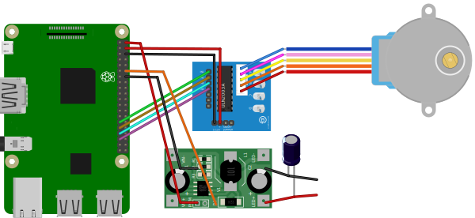

# RoboScan
This is the source code for a Lego+Raspberry Pi-powered analog film roll scanner. Watch it in action:
[](https://youtu.be/yRDomN48SOs)

## Parts
You'll need these items to build RoboScan:
* A digital camera with a macro lens: must be compatible with [libgphoto2 with image capture and preview support](http://gphoto.org/proj/libgphoto2/support.php).
* A Raspberry Pi: you may choose a Pi 4 if your camera supports USB 3, otherwise a Pi 2 or 3 is fine.
* A 28BYJ-48 Stepper Motor with ULN2003A driver: easy to find and cheap (about $6)
* 3D-print an adapter to integrate the stepper motor in the legos: use the stepper mount and axis adapter provided by this project (you'll need some bolts to attach the motor to the adapter): [https://create.arduino.cc/projecthub/fredrikstridsman/lego-stepperbot-df26b9](https://create.arduino.cc/projecthub/fredrikstridsman/lego-stepperbot-df26b9).
* [Adafruit White LED Backlight Module](https://www.adafruit.com/product/1621).
* A LED driver such as [Recom Power RCD-24-0.70/PL/B](https://www.digikey.com/en/products/detail/recom-power/RCD-24-0-70-PL-B/2612677) or [Sparkfun FemtoBuck LED Driver](https://www.sparkfun.com/products/13716).
* A 50V, 47 μF capacitor
* A high-power LED, such as [New Energy LST1-01G03-4095-01](https://www.digikey.com/en/products/detail/new-energy/LST1-01G03-4095-01/9816712): a 4000K white LED, with a CRI (Color Rendering Index) of 95.
* Build the lego part: [https://www.mecabricks.com/en/models/r121kn4gvlB](https://www.mecabricks.com/en/models/r121kn4gvlB).

## Part 1: Wiring

### Diagram


(made using Fritzing with the help of parts from [e-radionica.com](https://github.com/e-radionicacom/e-radionica.com-Fritzing-Library-parts-) and [Blomquist](https://forum.fritzing.org/t/led-driver-board-350ma-pwm-updated-with-test-part-v3/3322/19))

### ULN2003A wiring
Put a 50V, 47 μF capacitor between the LED+ and LED - pins of the driver.

| ULN2003A Stepper Motor driver | Raspberry Pi |
| ----------- | ----------- |
| IN1 | GPIO 5 |
| IN2 | GPIO 6 |
| IN3 | GPIO 13 |
| IN4 | GPIO 19 |
| POWER+ | 5V power (such as the one next to the Ground) |
| POWER - | Ground (such as the one next to the 5V power) |

### Recom Power RCD-24-0.70/PL/B Backlight LED driver wiring
| Recom Power RCD-24-0.70/PL/B | Raspberry Pi |
| ----------- | ----------- |
| 1 - +Vin | 5V power (the one not already used by the stepper motor) |
| 3 - PWM/ON/OFF | GPIO 18 |
| 4 - GND | Ground (such as the one next to the GPIO 18) |

### Alternative: Sparkfun FemtoBuck Backlight LED driver wiring
**Untested** - make sure to solder the jumper that can be closed with a glob of solder to double the output current from 330mA to 660mA.
| Sparkfun FemtoBuck LED Driver | Raspberry Pi |
| ----------- | ----------- |
| V-/PGND | Ground (any remaining) |
| V+/VIN | 5V power (the one not already used by the stepper motor) |
| D-/DGND | Ground (such as the one next to the GPIO 18) |
| D+/CTRL | GPIO 18 |


## Part 2: Software installation

### Prepare the Raspberry Pi
Follow Raspberry foundation documentation, such as: [https://projects.raspberrypi.org/en/projects/raspberry-pi-setting-up](https://projects.raspberrypi.org/en/projects/raspberry-pi-setting-up).
Tip: you can set the hostname of your Raspberry Pi to "piscanner" as it's what's used in this tutorial. You can use [raspi-config](https://www.raspberrypi.org/documentation/configuration/raspi-config.md) for this.

### Install Docker
The easiest is to use the "convenience script" as described here: [https://docs.docker.com/engine/install/debian/#install-using-the-convenience-script](https://docs.docker.com/engine/install/debian/#install-using-the-convenience-script).

In a nutshell:
```bash
curl -fsSL https://get.docker.com -o get-docker.sh
sudo sh get-docker.sh
# Add your user to the docker group
sudo groupadd docker
sudo usermod -aG docker $USER
```

### Install docker-compose
Full docker-compose installation instructions are available here: [https://docs.docker.com/compose/install/#install-compose-on-linux-systems](https://docs.docker.com/compose/install/#install-compose-on-linux-systems).
In a nutshell:
```bash
# Run this command to download the current stable release of Docker Compose
sudo curl -L "https://github.com/docker/compose/releases/download/1.29.2/docker-compose-$(uname -s)-$(uname -m)" -o /usr/local/bin/docker-compose
# Apply executable permissions to the binary
sudo chmod +x /usr/local/bin/docker-compose
```

### Clone this repository on your Raspberry Pi
```bash
git clone https://github.com/bezineb5/RoboScan.git
cd RoboScan
```

### Start the application
Now, you will ask docker to build and start the application. This might take a while (30-120 minutes).
```bash
cd docker
docker-compose up -d --build
```

It will start all components and restart them at reboot.

## Part 3: Using RoboScan
The camera must be connected to the Raspberry Pi via USB. It must be compatible with [libgphoto2](www.gphoto.org/proj/libgphoto2/support.php).

### Connect to the web interface
Simply navigate to [http://piscanner/](http://piscanner/) (adjust the hostname to your Raspberry Pi)

### Optional: Google Coral TPU
You can improve the machine learning inference performance by using a [Google Coral Edge TPU USB Accelerator](https://coral.ai/products/accelerator) plugged on a USB port of the Raspberry Pi.
To do so, you have to change the file src/Dockerfile. Replace:
```Dockerfile
CMD ["python", "webapp.py", "--destination", "/storage/share", "--archive", "/storage/archive", "--temp", "/storage/tmp"]
```
by:
```Dockerfile
CMD ["python", "webapp.py", "-tpu", "--destination", "/storage/share", "--archive", "/storage/archive", "--temp", "/storage/tmp"]
```

### Optional: for developers
The easiest is to code on you PC and deploy docker containers remotely. To do so, [enable remote access to the docker daemon](https://docs.docker.com/engine/install/linux-postinstall/#configure-where-the-docker-daemon-listens-for-connections).

```bash
# Set the DOCKERHOST variable (only once)
export DOCKER_HOST=tcp://piscanner:2376 DOCKER_TLS_VERIFY=

# Then deploy as usual
cd docker
# Adjust the hostname to your Raspberry Pi
docker-compose up -d --build
cd ..
```
